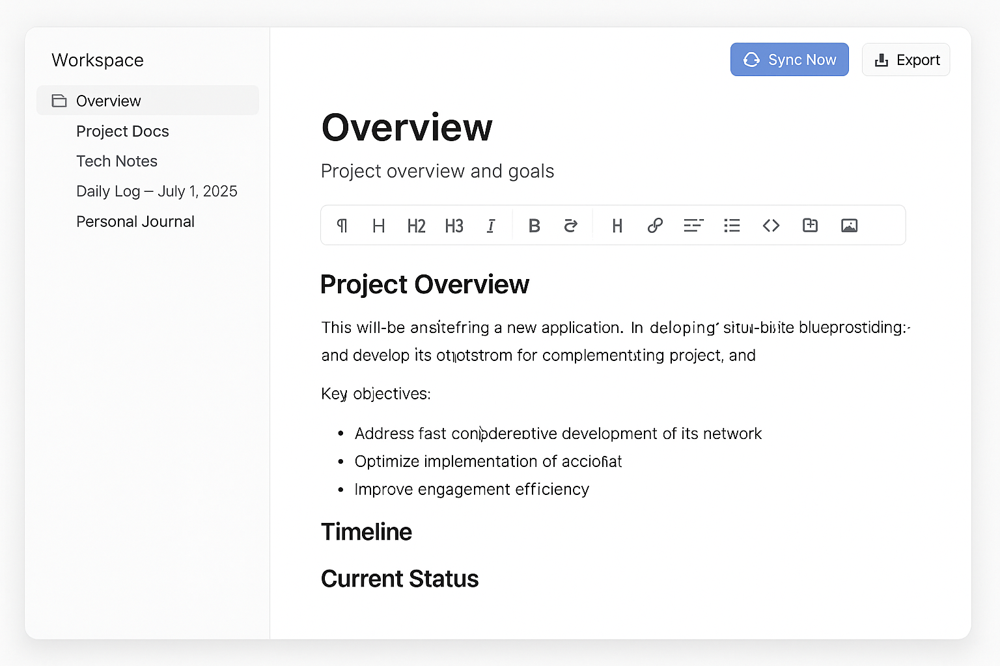

# 📝 Note Taking App

一个现代化的笔记应用，基于 Next.js 15 和 React 19 构建，提供丰富的文本编辑功能和 AI 聊天助手。



## ✨ 功能特性

- 📝 **富文本编辑器** - 基于 WangEditor 的强大编辑功能
- 🤖 **AI 聊天助手** - 集成 AI 服务，智能问答
- 🌙 **深色/浅色主题** - 支持主题切换
- 💾 **本地存储** - 使用 LocalForage 进行数据持久化
- ☁️ **WebDAV 同步** - 支持 WebDAV 服务器同步
- 📱 **响应式设计** - 适配桌面和移动设备
- 🎨 **现代 UI** - 基于 shadcn/ui 组件库
- 🚀 **高性能** - 使用 Turbopack 快速构建

## 🛠️ 技术栈

- **框架**: Next.js 15.2.4
- **UI 库**: React 19
- **语言**: TypeScript
- **样式**: Tailwind CSS
- **组件库**: Radix UI + shadcn/ui
- **编辑器**: WangEditor
- **状态管理**: Zustand
- **本地存储**: LocalForage
- **图标**: Lucide React
- **构建工具**: Turbopack

## 🚀 快速开始

### 环境要求

- Node.js 18.0 或更高版本
- pnpm (推荐) 或 npm

### 安装依赖

```bash
# 使用 pnpm (推荐)
pnpm install

# 或使用 npm
npm install
```

### 开发模式

```bash
# 使用 pnpm
pnpm dev

# 或使用 npm
npm run dev
```

打开 [http://localhost:3000](http://localhost:3000) 查看应用。

### 构建生产版本

```bash
# 构建
pnpm build

# 启动生产服务器
pnpm start
```

## 📁 项目结构

```
note-taking-app/
├── app/                    # Next.js App Router
│   ├── globals.css        # 全局样式
│   ├── layout.tsx         # 根布局
│   └── page.tsx           # 主页面
├── components/            # React 组件
│   ├── ai/               # AI 聊天相关组件
│   ├── editor/           # 富文本编辑器组件
│   ├── settings/         # 设置页面组件
│   ├── sidebar/          # 侧边栏组件
│   └── ui/               # UI 基础组件 (shadcn/ui)
├── hooks/                # 自定义 React Hooks
├── lib/                  # 工具函数和服务
│   ├── ai-service.ts     # AI 服务接口
│   ├── storage.ts        # 本地存储服务
│   ├── store.ts          # Zustand 状态管理
│   ├── types.ts          # TypeScript 类型定义
│   ├── utils.ts          # 工具函数
│   └── webdav.ts         # WebDAV 同步服务
├── public/               # 静态资源
└── ...                   # 配置文件
```

## 🔧 配置

### AI 服务配置

在应用的设置页面中配置你的 AI 服务 API：

1. 点击设置按钮
2. 选择 "AI 设置"
3. 输入你的 API 密钥和服务配置

### WebDAV 同步配置

配置 WebDAV 服务器进行笔记同步：

1. 进入设置页面
2. 选择 "WebDAV 设置"
3. 输入服务器地址、用户名和密码

## 📝 使用说明

### 创建和编辑笔记

1. 在左侧边栏点击 "新建笔记" 按钮
2. 使用富文本编辑器编写内容
3. 笔记会自动保存到本地存储

### AI 聊天助手

1. 点击右侧的 AI 聊天按钮
2. 输入问题或请求
3. AI 助手会根据你的笔记内容提供帮助

### 主题切换

点击右上角的主题切换按钮，在深色和浅色主题之间切换。

## 🤝 贡献

欢迎提交 Issue 和 Pull Request！

1. Fork 本仓库
2. 创建你的特性分支 (`git checkout -b feature/AmazingFeature`)
3. 提交你的更改 (`git commit -m 'Add some AmazingFeature'`)
4. 推送到分支 (`git push origin feature/AmazingFeature`)
5. 开启一个 Pull Request

## 📄 许可证

本项目采用 MIT 许可证 - 查看 [LICENSE](LICENSE) 文件了解详情。

## 🙏 致谢

- [Next.js](https://nextjs.org/) - React 框架
- [shadcn/ui](https://ui.shadcn.com/) - UI 组件库
- [WangEditor](https://www.wangeditor.com/) - 富文本编辑器
- [Radix UI](https://www.radix-ui.com/) - 无样式组件
- [Tailwind CSS](https://tailwindcss.com/) - CSS 框架
- [Lucide](https://lucide.dev/) - 图标库

---

如果你觉得这个项目有用，请给它一个 ⭐️！ 